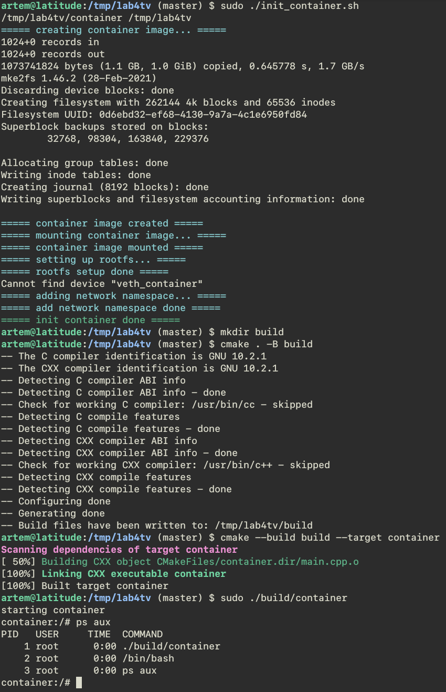

# Lab 4 - create simple container

## Build
```
sudo ./init_container.sh # prepare environment for container
mkdir build
cmake . -B build
cmake --build build --target container
```
## Run
```
sudo ./build/container
```
